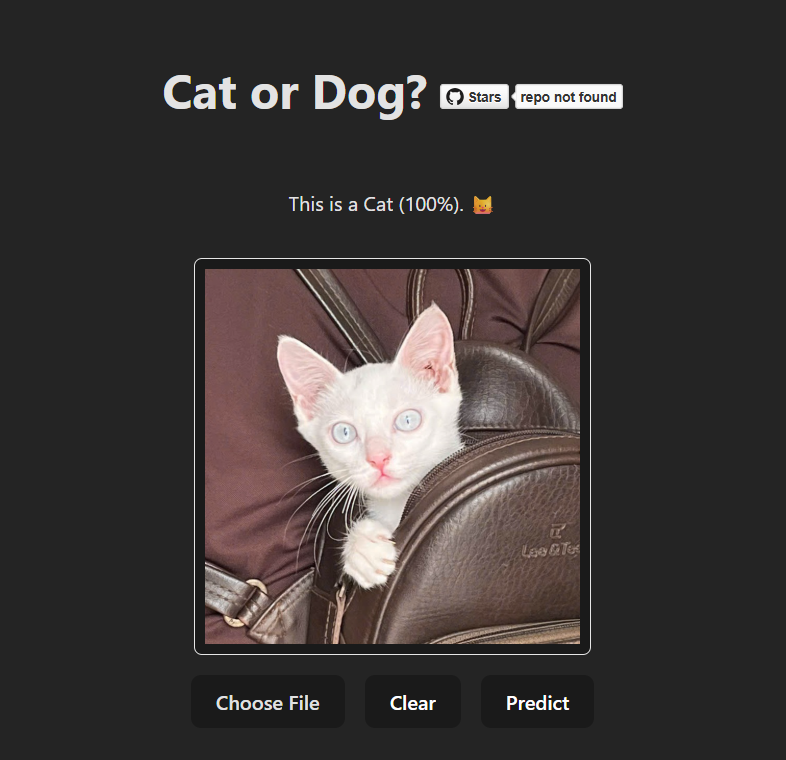

# **Cat or Dog?**

A web application that uses a machine learning model to classify images as either a cat or a dog. The project leverages OpenVINO Model Server (OVMS) for inference, a Node.js backend for preprocessing and API handling, and a React-based frontend for user interaction.

The AI model used in this project was trained and evaluated using the code from the [Cat-Dog Classification](https://github.com/hnthap/cat-dog-classification) repository. 

## Table of Contents
1. [Features](#features)
2. [Tech Stack](#tech-stack)
3. **[🔰 Getting Started](#getting-started)**
4. [Project Structure](#project-structure)
5. [Endpoints](#endpoints)
6. **[⚙️ Development](#development)**
7. [Testing](#testing)
8. **[⭐ Future Improvements](#future-improvements)**
9. [Contributing](#contributing)
10. [License](#license)
11. [Acknowledgments](#acknowledgments)

---- 

## **Features**

- Upload an image to determine the probability of it being a cat or dog.
- Real-time image preprocessing and inference using OpenVINO Model Server.
- Responsive React frontend for seamless user experience.
- Scalable backend with image validation and preprocessing.
- Dockerized deployment for easy setup and portability.

----

## **Tech Stack**

### **Frontend**

- **React**: Built with TypeScript for type safety.
- **Axios**: For making API requests to the backend.
- **Vite**: For fast development and optimized builds.

### **Backend**

- **Node.js**: Express-based server for handling API requests.
- **Multer**: For handling image uploads.
- **Sharp**: For image preprocessing.
- **Fetch**: For communicating with the OpenVINO Model Server.

### **Machine Learning**

- **OpenVINO Model Server (OVMS)**: Serves the pre-trained model for inference.

### **Deployment**

- **Docker**: Multi-container setup using `docker-compose` for the frontend, backend, and model server.
- **Nginx**: Serves the static frontend files.

----

## **🔰 Getting Started**

### **Prerequisites**

- Docker and Docker Compose installed on your machine.
- Node.js (if running locally without Docker).

### **Setup**

1. **Clone the Repository**:
   ```bash
   git clone https://github.com/hnthap/cat-or-dog.git
   cd cat-or-dog
   ```

2. **Environment Variables**:
   Create a `.env` file in the [backend](./backend/) directory and configure the following variables:
   ```env
   OVMS_HOSTNAME=model-server
   OVMS_PORT=8000
   FRONTEND_ORIGIN=http://localhost:3000
   BACKEND_API_INFER_URL=http://localhost:3001/v1/infer
   ```
   Notes that `FRONTEND_ORIGIN` and `BACKEND_API_INFER_URL` are currently set for development. Change them to appropriate values in production.

3. **Run with Docker Compose**:
   ```bash
   docker-compose up --build
   ```
   This will start:
   - OpenVINO Model Server on `http://localhost:8000`
   - Backend server on `http://localhost:3001`
   - Frontend on `http://localhost:3000`

4. **Access the Application**:
   Open your browser and navigate to `http://localhost:3000`.

----

## **Project Structure**

### **Frontend**

- **Path**: [vite-client/](./vite-client/)
- **Key Files**:
  - [App.tsx](./vite-client/src/App.tsx): Main React component handling file uploads and predictions.
  - [components/](./vite-client/src/components/): Reusable UI components like [`Header`](./vite-client/src/components/Header/Header.tsx), [`ImageCard`](./vite-client/src/components/ImageCard/ImageCard.tsx), and [`FileUploader`](./vite-client/src/components/FileUploader/FileUploader.tsx).
  - [Dockerfile](./vite-client/Dockerfile): Dockerfile for the frontend service.

### **Backend**

- **Path**: [backend/](./backend/)
- **Key Files**:
  - [server.js](./backend/server.js): Express server handling image uploads, preprocessing, and inference.
  - [Dockerfile](./backend/Dockerfile): Dockerfile for the backend service.

### **Model Server**

- **Path**: [models/](./models/)
- **Key Files**:
  - Pre-trained model files for the "Cat or Dog" classification.

### **Docker Compose**

- **Path**: [docker-compose.yaml](./docker-compose.yaml)
- **Purpose**: Orchestrates the frontend, backend, and model server containers.

----

## **Endpoints**

### **Backend API**
- **POST /v1/infer**
  - **Description**: Accepts an image file and returns the probability of it being a cat.
  - **Request**:
    - `Content-Type: multipart/form-data`
    - Body: `{ image: <file> }`
  - **Response**:
    ```json
    {
      "cat": 95.3
    }
    ```

----

## **⚙️ Development**

### **Frontend**

1. Navigate to the [vite-client](./vite-client/) directory:
   ```bash
   cd vite-client
   ```
2. Install dependencies:
   ```bash
   npm install
   ```
3. Start the development server:
   ```bash
   npm run dev
   ```

### **Backend**

1. Navigate to the [backend](./backend/) directory:
   ```bash
   cd backend
   ```
2. Install dependencies:
   ```bash
   npm install
   ```
3. Start the server:
   ```bash
   node server.js
   ```

----

## **Testing**

### **Frontend**

Frontend tests are not yet available.

<!-- - Run unit tests (if implemented):
  ```bash
  npm test
  ``` -->

### **Backend**
- Test the `/v1/infer` endpoint using tools like Postman or cURL:
  ```bash
  curl -X POST -F "image=@path/to/image.jpg" http://localhost:3001/v1/infer
  ```

----

## **⭐ Future Improvements**

### **General**

- [ ] Deploy a Live Demo

### **Frontend**

- [ ] Drag and Drop image into view
- [ ] Use Toasts instead of alert()
- [ ] Add tests

### **Backend**

- [x] Use dotenv-safe to manage environment variables
- [ ] Use logging library instead of console.log
- [ ] Use queue system to process requests asynchronously
- [ ] Use express-validator or Joi to validate request data
- [ ] Add rate limiting with express-rate-limit
- [ ] Use ndarray for matrix operations in preprocess()
- [ ] Add unit tests for critical functions like infer() and preprocess()
- [ ] Mock OVMS responses for testing purposes, under different scenarios, e.g., success, failure, invalid response
- [ ] Add API documentation using Swagger or Postman
- [ ] Validate `OVMS_*` environment variables at startup
- [ ] Remember to test preprocess() with edge cases, such as (1) extremely small or large images, (2) image with unsupported format, (3) corrupted image files
- [ ] Make startup log message more descriptive, e.g., "development" or "production" mode, OVMS host and port, etc.

----

## **Contributing**

Contributions are welcome! Please fork the repository and submit a pull request with your changes.

----

## **License**
This project is licensed under the MIT License. See the [LICENSE](./LICENSE) file for details.

----

## **Acknowledgments**

- [OpenVINO Model Server](https://github.com/openvinotoolkit/model_server)
- [Sharp](https://sharp.pixelplumbing.com/)
- [Vite](https://vitejs.dev/)

----